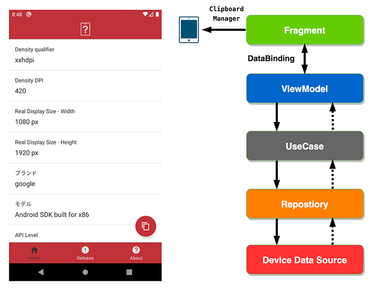
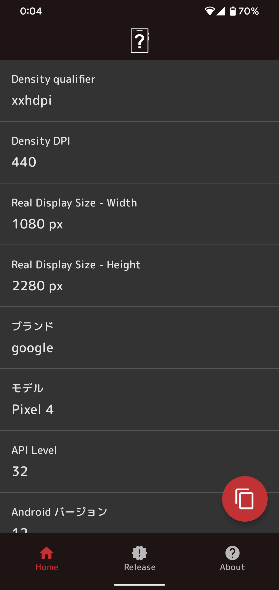

# Tell me your dpi App

このプロジェクトは、使用者のデバイスのDensity Qualifierなどの画面に関わる情報や、OSの情報などを表示するAndroidアプリを開発しています。

自身のAndroidへの理解を深める目的で、新しい技術を採用させやすいミニマムなプロジェクトでスタートさせました。

次のGoogle Playのリンクよりリリースしたアプリのダウンロードが可能です。

# 動作イメージ

# 機能
自分のデバイスがどの密度サイズ（xxhdpiなどAndroid Studioで認識される情報）であったかなどを1つの画面で確認でき、表示した情報をまとめてクリップボードにコピーすることもできるようになっています。

その他の画面として、リリースノートやプライバシーポリシーなどのアプリに関しての画面があります。

Androidの最新の宣言型 UI ツールキットである Jetpack Compose で構築しています。

ダークテーマにも対応しており、Android 10 以上であればユーザーのデバイスで設置を変えることにより、表示の切り替えが可能です。

Google Play In-App Review API でアプリ内レビューを表示するようにしました。

Android 13で追加されたPost Notifications Permissionの確認用に通知機能を追加しました。

DIはDagger Hiltを使用し実装しています。

# 開発環境
Android Studio Chipmunk で開発を行っています。

コードはKotlinで記述しています。

# 動作環境

Android 5.0 から Android 13.0 で動作するように設計されています。

# アーキテクチャ

このアプリは[Google I/O Android App](https://github.com/google/iosched)のアーキテクチャを参考に作成しています。

同様にAACをベースにMVVMにクリーンアーキテクチャの概念を一部取り入れ、UseCase、Repository、各DataSourceが追加される形となっています。

DIはDagger Hiltを使用することで、簡潔に記述することができるようになりました。

Jetpack Composeと相性のよいState Flowを利用し、データソースの状態にあわせUIに自動的に通知されるようになっています。

Kotlin、Kotlin Coroutines、Firebase、Retrofitがそれらを支えています。

## 画面構成
画面の構成はActivityはMainActivityのみとなっており、Home、リリースノート、このアプリについての各画面がFragmentで切り替わる仕組みになっています。

画面下にはBottomNavigationを配置し、各ボタンをクリックすることでFragmentが切り替わるようになっています。

Navigation GraphとBottomNavigationを利用することで、コード上ではFragmentの生成処理はあえて記述せずに済むようになりました。

## Home(Device info)

デバイスのDPIやOSバージョン、メモリの情報などを表示する画面です。

右下のフローティングボタンをクリックすることにより、表示している情報をクリップボードへコピーすることも可能です。

デバイスの情報をここではデータソースと見立て、Kotlin Coroutinesを使用し、非同期に受け取るようにしています。

データソースはState Flowで更新されるようになっており、ViewModelと連携し自動的に取得したデータを通知します。

データソースにはApplicationContextのみ渡しています。

各データは次の項目から取得しています。

- 画面密度: displayMetrics

- ディスプレイサイズ: WindowManager

- メモリ情報: ActivityManager

- その他のOSの情報など: Build

## ReleaseNotes（リリースノート）

アプリのリリースノートを表示する画面です。

アプリのリリースタイミングで更新ができるように、Webサイト上に配置したJSONファイルからデータを取得し、Lazy Columnでリスト形式で各バージョンのリリース情報を表示しています。

AccompanistのSwipeRefreshで再読み込みにも対応しています。

今後、REST APIなどにデータソースを変更した場合にも、アプリの変更をせずに対応できるようにする狙いもあります。

データの取得には [Retrofit](https://github.com/square/retrofit) を使用しています。

Retrofitがsuspendをサポートするようになったため、非同期処理部分は今回はRxJavaの採用は見送り、最近採用が増えてきている[Coroutines Flow](https://kotlin.github.io/kotlinx.coroutines/kotlinx-coroutines-core/kotlinx.coroutines.flow/-flow/)を使用して実装しています。

これによりコードが簡潔に記載でき、状態の管理も非常に簡単にできるようになっています。

例としてストリームとState Flowを合わせることで、ローディングや成功時のリスト表示、エラーの表示を簡単に記載することができるようになっています。

### エラー時の処理

エラーもストリームで管理が容易なためエラー時のみ専用の画面を表示し、再読み込み用のボタンをクリックすることで再度UseCaseからRepositoryに対しリリースノートのデータ取得をするように指示するのみですみます。

クリック後にエラーメッセージを消去する処理もState Flowがストリームに紐付いているため、あえてコーディングせずに自動的に状態が変わり非表示になるようになっています。

ローディングのProgressBarについても同様の処理で自動的に表示・非表示がなされています。

## AboutApp（Tell me your DPI? について）

このアプリについての各種情報を表示する画面です。

UIのみで制御可能な情報しかないため、UseCaseやRepositoryなどは使用していません。

### アプリバージョン

BuildConfig.VERSION_NAME よりアプリバージョンを表示しています。

### プライバシーポリシー

プライバシーポリシーはアプリの機能追加とは別のタイミングで変更が予想されるため、Webページ上に配置しています。

アプリからは [AndroidBrowserHelper](https://github.com/GoogleChrome/android-browser-helper) を使用し表示しています。

AndroidBrowserHelper の AppBar をダークテーマに対応できるように実装していますが、Webページを表示するビュー部分はアプリからは変更できないため、WebページのCSSにダークテーマの設定を追加し対応しています。

### オープンソース ライセンス

[Google Play services Plugins](https://github.com/google/play-services-plugins) の oss-licenses-plugin を使用し、自動で使用ライブラリの情報を収集し、各ライブラリのライセンス情報を表示しています。

こちらもダークテーマに対応できるよう実装しています。

このライブラリから作成されるActivityのAppBarのバックボタンへのダークテーマの対応方法がわからなかったため、アイコンを差し替えることで対応しています。

# Jetpack Compose

アプリ全体を既存のAndroid Viewから、最新のUIツールキットであるJetpack Composeで構築をし直しました。

Googleは既存のAndroid Viewはメンテナンスモードとしているため、今後の新機能を使用する場合はJetpack Composeで構築していくことが必要になってきます。

まだベストプラクティスも確立しておらず、Android Viewでの設計とは大きく異なるため検討することが多いのが現実です。

Accompanistライブラリも一部使用して、Android Viewで実現できたことと同じものを実現しています。

# DarkTheme

このアプリはダークテーマに対応しています。

Android 10以上であれば、設定のダークテーマの有効・無効で画面表示がそれぞれに合わせた配色に切り替わるようになっています。

専用のテーマや配色、アイコンを定義することで対応しています。

# アダプティブアイコン

MaterialDesignに合わせた形でアダプティブアイコンを作成しています。

Illustratorでアプリのロゴアイコンを作成し、svg形式のファイルをVectorAssetとしてリソースへ取り込んでいます。

# Firebase

いくつかのFirebaseのサービスを利用しています。

### Messaging

プッシュ通知の受信用に利用しています。

Android 13では 通知を受け取るのにユーザーの通知権限の許可が必要になりました。

通知権限が必要な理由を画面上で表示するとユーザーの理解が得られやすいため、説明用の画面を追加しています。

 

### Hosting

リリースノートのJSONファイルやプライバシーポリシーはFirebase Hostingへデプロイしています。

最初はGithub Pagesを使用していましたが、AndroidBrowserHelperで使用しているassetlinks.jsonの配置場所がドット付きのディレクトリのためかうまくいかなかったため移行しました。

プライバシーポリシーはAndroid端末で表示しても問題ないようにBootStrapを使用してレスポンシブ対応しています。

### Analytics

アプリのAnalyticsのscreen_viewのログを送信しています。

アプリの利用状況の分析に利用されます。

### Crashlytics

クラッシュログの送信を行っています。

想定しないクラッシュの解析に役立てます。

### App Distribution

アプリの開発中に指定の端末にテスト用のアプリを配信します。

GithubActionsでプルリクエスト時に自動テストを実行し、開発チーム内にApp Distributionを通して自動配信するCI/CDツールとしての使い方を可能にしています。

## Google Play In-App Review API

レビュー訴求する方法として、Play Core LibraryのGoogle Play In-App Review APIを使用しアプリ内でレビュー可能なようにしました。

# CI/CD

Github Actionsを使用し、CI/CDの仕組みを実現しています。

Pull Requestがあった場合に、標準のlintチェックをし、ビルドとktlintを実行。その結果を使用し、Dangerで自動コードレビューを行います。

自動コードレビューによりPRに対してのチェックを簡略化でき、コードのレビューに対してのみ集中できるようになります。

その後にApp Distributionへ各テスターのデバイスに自動配信を行い、開発チームでの確認を可能にしています。

# デザイン

Adobe XDでプロトタイプデザインを行いました。

アプリの完成イメージを想像しやすくなり、開発の方針を決めるのに役立ちました。

# 使用ライブラリ

- [Android Jetpack](https://developer.android.com/jetpack/)
  - Core
  - ConstraintLayout
  - JetpackCompose
  - AppCompat
  - Accompanist
  - Navigation
  - [Lifecycle](https://developer.android.com/jetpack/androidx/releases/lifecycle)
    - ViewModel
- [Play Core Library](https://developer.android.com/reference/com/google/android/play/core/release-notes)
- [Material Components for Android](https://github.com/material-components/material-components-android)
- [Kotlin](https://kotlinlang.org/)
  - kotlin-stdlib
  - Coroutines
- [Firebase](https://firebase.google.com/)
  - Analytics
  - Crashlytics
  - Performance
  - Messaging
- [Retrofit](https://github.com/square/retrofit)
- [Moshi](https://github.com/square/moshi/)
- [AndroidBrowserHelper](https://github.com/GoogleChrome/android-browser-helper)
- [Timber](https://github.com/JakeWharton/timber)
- [Google Play services Plugins](https://github.com/google/play-services-plugins)
  - oss-licenses-plugin