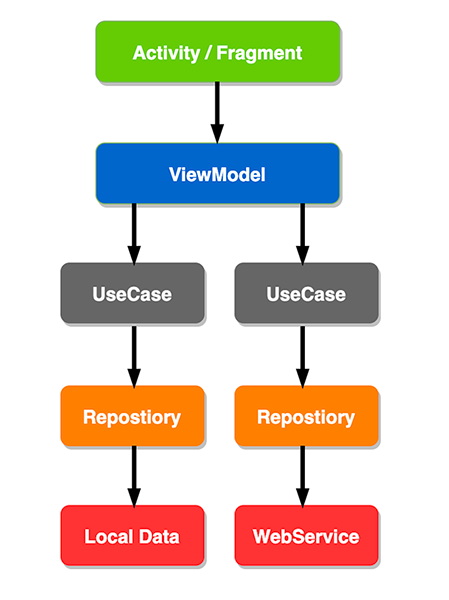

# Tell me your dpi App

# アーキテクチャ

このアプリは[Google I/O Android App](https://github.com/google/iosched)のアーキテクチャを参考に作成しています。
MVVMをベースにクリーンアーキテクチャを取り入れ、UseCase、Repository、DataSourceが追加される形となっています。

## Home(Device info)

## ReleaseNotes

## AboutApp

# デザイン
TODO: Put a AdobeXD ScreenShot.

# 使用ライブラリ

- [Android Jetpack](https://developer.android.com/jetpack/)
  - Core
  - ConstraintLayout
  - MultiDex
  - AppCompat
  - RecyclerView
  - Navigation
  - [Lifecycle](https://developer.android.com/jetpack/androidx/releases/lifecycle)
    - ViewModel
    - LiveData
- [Material Components for Android](https://github.com/material-components/material-components-android)
- [Kotlin](https://kotlinlang.org/)
  - kotlin-stdlib
  - Coroutines
- [Firebase](https://firebase.google.com/)
  - Analytics
  - Crashlytics
  - Performance
- [Retrofit](https://github.com/square/retrofit)
- [Moshi](https://github.com/square/moshi/)
- [AndroidBrowserHelper](https://github.com/GoogleChrome/android-browser-helper)
- [Timber](https://github.com/JakeWharton/timber)
- [Google Play services Plugins](https://github.com/google/play-services-plugins)
  - oss-licenses-plugin